Theory
====================================

Normal Mode Analysis (NMA)
--------------------------

NMA analyses the oscillations of a structure. For proteins, it is useful for studying the large amplitude motions for a selected conformation. The main assumption is that the motions are harmonic. Thus, each normal mode, which is a concerted motion of many atoms, acts as a simple harmonic oscillator and it is independent of all the other normal modes.

For a harmonic oscillator with a mass m supported on a spring with force constant *k*, the potential energy of the system, *V* = *kx*\ :sup:`2`, for an extension *x* leads to the restoring force,

.. image:: ../img/nma1.png

By substituting this Hooke’s Law force into Newton’s Law, **F** = *m*\ **a** leads to the differential equation,

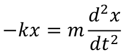

The solution is, |nma3| with |nma4| being the frequency of the vibration. 

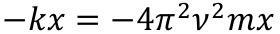

In three dimensions and for a set of *N* atoms, one has the corresponding generalized equation,

**-HX** = **-** |nma5| **X**

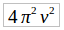

where **H** is the 3\ *N* x 3\ *N* Hessian symmetric matrix of force constants and **X** is the 3\ *N* x 1 vector of the positions of the atoms. The solutions of the equation may be cast in the form of an eigenvalue decomposition of **H** where the eigenvectors are the mass weighted displacements of the normal coordinates; i.e. the independent vibrational motions of the collection of atoms. The corresponding eigenvalues are the negative of the squared normal mode frequencies of each mode. **H** has exactly six zero eigenvalues for the translations and rotations of the molecule in three-dimensional space.

In NMA of proteins, it is central to obtain a good representation of the protein for a proper analysis of the available modes of motion. One approach would be to obtain the Hessian matrix from the second derivatives of the energy for the conformation of interest following a very stringent minimization of the molecule. The latter is important as NMA is based on the harmonic assumption which is only a valid approximation at the bottom of the potential energy minima. For the complex potentials representing interactions in proteins in the water environment, these second derivatives may be obtained through numerical methods which are extremely costly.

Alternatively, **H** may be approximated by the variance-covariance matrix of the protein, obtained from a molecular dynamics (MD) simulation of suitable length. This is relevant as it may be shown through employing statistical mechanics that the average displacements of nodes from a mean structure for an atom i, 🜂\ **R**\ :sub:`i` are related to those of all other atoms through the relationship, 

< 🜂\ **R**\ :sub:`i` ∙ 🜂\ **R**\ :sub:`j` > =3\ *k*\ :sub:`B`\ *T*  **H**\ :sup:`-1`

It is important to select the length of the MD simulation for this procedure such that the molecule samples only the state of interest,\ :sup:`1` since when more than a single potential energy well along the conformational space of the molecule is sampled, the harmonic assumption would again fail.

As a third alternative for obtaining the Hessian, one may make use of the elastic network property of a folded protein. Here, the assumption is that, once a protein folds to a functionally relevant conformation, its total energy is represented by a simple harmonic potential such that residues are connected to their nearest neighbors via elastic springs. By further employing the assumption that the spring constants, ϒ, are equivalent in all pairs of interactions, one arrives at the anisotropic network model (ANM).\ :sup:`2`

**H** is thus composed of *N* x *N* super-elements, i.e., 

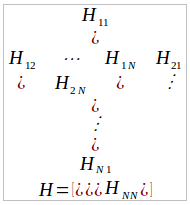

where each super-element **H**\ :sub:`ij`   is a 3 x 3 matrix that holds the anisotropic information regarding the orientation of nodes *i*,*j*:	

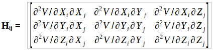

Denoting the separation between nodes *i* and *j* by |nma9| , the elements of the off-diagonal super-elements **H**\ :sub:`ij` are given by:	

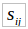

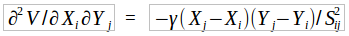

and those of the diagonal super-elements **H**\ :sub:`ii` are obtained via,

|nma11| for the diagonal terms

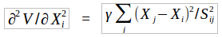

|nma12| for the off-diagonal terms.

.. |nma12| image:: ../img/nma12.png

In this representation of the protein, the structure is coarse-grained at the level of a residue, usually through the coordinates of Cα or Cβ atoms obtained from the protein data bank. Moreover, pairs of nodes are assumed to interact if they are within a pre-selected cut-off distance, *r*\ :sub:`c`. For large structures such as viruses, further coarse graining may be shown to well describe the most collective modes of motion.

The selection of *r*\ :sub:`c` has been the cause of much research. While it is clear that there is a lower bound where the condition of six zero eigenvalues of **H** should be satisfied, distances in the range 10-25 Å have been employed in the literature. It has been shown by a systematic study of increasing *r*\ :sub:`c` that the collective modes of motion do not change beyond a certain value for proteins; i.e. selection of too large *r*\ :sub:`c` is safer than a too small value.\ :sup:`3` The reason for this has been explained by expressing **H** as the sum of an essential and a trivial part. The essential part of **H** includes all the local information necessary for the correct representation of the modes. On the other hand, due to the symmetries in a protein originating from the orientational order of closely packed spheres, the effects from the long range neighbors cancel out.

1. C. Atilgan, O.B. Okan, A.R. Atilgan, "Network-based Models as Tools Hinting at Non-evident Protein Functionality," Annual Review of Biophysics, 41, 205-225 (2012).

2. A.R. Atilgan, S.R., Durell, R.L. Jernigan, M.C. Demirel, O. Keskin, I. Bahar, "Anisotropy of Fluctuation Dynamics of Proteins with an Elastic Network Model," Biophysical Journal, 80, 505-515.

3. C. Atilgan, O.B. Okan, A.R. Atilgan, "Orientational Order Governs Collectivity of Folded Proteins," Proteins: Structure, Function, Bioinformatics, 78, 3363-3375 (2010).

Principle Component Analysis (PCA)
----------------------------------

A molecular dynamics (MD) simulation of a protein provides the positional movements of each atom with
respect to a fixed reference frame at a given time. The mean squared positional fluctuations (variances) of
each atom are readily calculated once the total simulation and sampling times are set. Sufficiency of both
total observation period and the sampling rate are crucial in collecting the data so as to identify biologically
relevant motions.
Let us monitor the variance of each residue’s Cα (or Cβ) atom during a MD simulation of a protein. Suppose
that these variances do not change significantly in time, like a stationary process. This suggests that within
the period of observation we have recorded the motion about one (native) conformation. Though constant in
time for a given residue, the variances do change from one residue to another. It is important to distinguish
the differences between the variances of different parts of the protein and to explain the root cause of these
differences; e.g. while loop or disordered regions exhibit high values, relatively rigid parts, such as helices
or sheets display lower variances.

PCA\ :sup:`1` operates on the variance-covariance matrix, **C**, of the protein, obtained from a MD simulation of any
length; thus, the observed process need not be stationary. It is useful in distinguishing the different parts of
the energy landscape sampled during the MD simulation. To obtain **C**, first the protein coordinates are
superimposed on a reference structure, usually the initial coordinates, or the average coordinates. The
displacement vector for each residue (described by the Cα or Cβ coordinates of the residue *i* ) at a time point
*t*,🜂\ **R**\ :sub:`i`\ (t) is obtained. For a set of *M* recorded coordinates, these are organized in the trajectory fluctuation
matrix of order 3\ *N* x *M*:

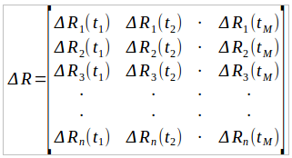

The 3\ *N* x 3\ *N* **C** matrix is then obtained via the operation,

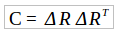

If a single energy well along the potential energy surface of a protein is sampled, then **C** approximates the
inverse Hessian, **H**\ :sup:`-1` , as the harmonic approximation applies in this case (see NMA for details). However, if
different parts of the landscape are sampled, the decomposition of **C** will carry information on all the
regions entered during the simulation. Thus, the diagonalization, 

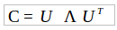

yields the eigenvectors and the corresponding eigenvalues of the **C** matrix. **Ʌ** is the 3\ *N* x 3\ *N* diagonal 
matrix holding the eigenvalues *λ*\ :sub:`i` with six zero values corresponding to the translations and rotations of the
molecule. The *i* \ :sup:`th`  row of the **U** matrix holding the eigenvector corresponding to the *i* \ :sup:`th` eigenvalue. The
trajectory |pca4| may be projected onto the eigenvectors to obtain the principal components, *q*\ :sub:`i`, which are the rows
of the 3\ *N* x *M* **Q** matrix.

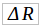

Since a few principal components usually carry the largest amount of information of the trajectory, the
different regions of the conformational space will manifest as more than one blob in a plot of *q*\ :sub:`i` versus *q*\ :sub:`j`
where *i* and *j* are small. Furthermore, the size of the blobs in the plots will provide information on the width
of the potential wells sampled. Finally, the time points when passage between different wells occur may be
pinpointed by this method.
The different implementations of the construction of the **C** matrix and the various ways of decomposing it
have been discussed in detail in the literature,\ :sup:`2` and implemented in MODE-TASK.

1. A. Amadei, A.B.M. Linssen, H.J.C. Berendsen, “Essential Dynamics of Proteins,” Proteins: Structure, Function and Genetics, 17, 412-425 (1993).

2. C.C. David, D.J. Jacobs, “Principal component analysis: a method for determining the essential dynamics of proteins,” Methods in Molecular Biology, 1084, 193-226 (2014).
